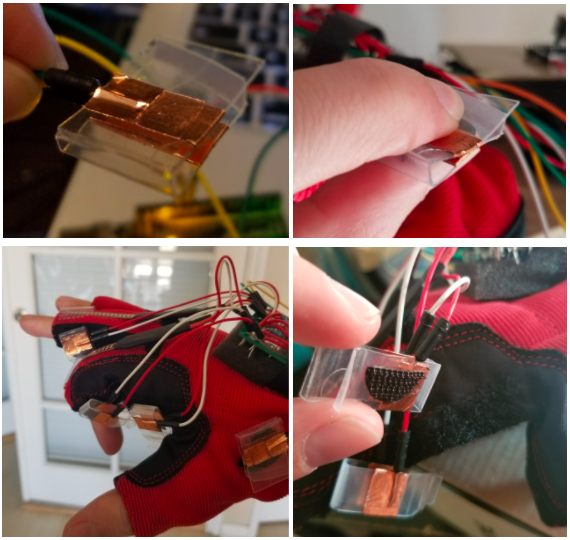

# Glove Mouse 2.0

Casey Mordini-Bluhm  
Electronics for Physical Measurements Lab, Spring 2020  
Professor Eric Hudson  

## Objective
The objective was to create a device that is wearable on the hand and has all the functionality of a standard computer mouse. The priorities, in descending order, were cursor movement, left click, right click, scroll, middle click, and pause of movement control (to reposition the hand or type). An additional requirement was that the user should be able to perform touch typing with no loss of accuracy or speed while wearing the glove. All of these objectives were met. 

## Design
The design used in this project is primarily based on the Glove Mouse project built by Hyodong Lee and Adam Shih when they were students of Bruce Land at Cornell University. Different transceivers and sensors were used, and one of the microcontrollers was replaced by an Arduino Uno. The code used in this project is a modified version of their code and code from PRJC.com. 

Many thanks to the original creators’ hard work and commitment to sharing of knowledge. Their project was followed closely, with some improvements made. There were also some aspects of the design that were less successfully implemented than in original project; nonetheless, I feel it appropriate to refer to the current project as Glove Mouse 2.0.

  
**Block diagram for Glove Mouse 2.0.** The project is made up of three units: the glove, the armband, and the base station. The glove houses sensors, which are monitored by an Arduino Uno on the armband. An RF transceiver on the armband transmits to an RF transceiver on the base station, which sends the data to a microcontroller connected to the computer. 

  
**Circuit diagram for the glove and armband.**

  
**Circuit diagram for the base station.**

### Hardware

#### The Glove
The foundation of the glove unit is a lightweight work glove. The fingertips were cut off and the cut edges folded inward and sewn. A small protoboard was attached to the back of the glove with a piece of foam between the glove and the board and a velcro strap holding it in place. This protoboard serves as the hub for several sensors: an accelerometer, two flex sensors, and four contact pads. A bundle of wires runs from the board to the Arduino on the armband unit. One of these wires is connected to the 5 V output on the Arduino and another is connected to ground. 

  
**Glove carrying the sensors.**

##### Accelerometer
The accelerometer is soldered directly to the protoboard on the back of the glove. It outputs three analog voltages proportional to the angle that it is tilted off of three Cartesian axes. These three analog voltages are connected to the first three analog pins of the Arduino. Additionally, the 3 V output on the accelerometer is connected to the AREF pin of the Arduino to improve the quality of the measurements. (This requires setting the voltage reference to external in the Arduino sketch.) 

##### Flex Sensors
Two flex sensors are mounted on the glove on the back of the pointer finger and middle finger. These are for left and right click, respectively. The flex sensors behave as variable resistors, so by using each as the top resistor in a voltage divider, two analog voltages proportional to the distance the fingers are flexed are sent to the A3 and A4 analog pins on the Arduino. The flex sensors used are flimsy near the leads and the leads themselves are somewhat delicate. Therefore, instead of soldering the leads, copper tape was used to connect them to longer stranded copper wires (jumper wires from Arduino Uno starter kit). Additionally, a housing was designed with shrink tubing and polypropylene strips to stop the flex sensors from bending at the weak point. The flex sensors are attached by velcro to the first knuckle of the fingers and held close to the tips of the fingers under plastic sleeves. These plastic sleeves were cut from the packaging of a hobby knife, bent into shape, and sewn in place. 

  
**Flex sensor casing (above) and mounting on glove (below).**

##### Contact Pads
Four contact pads are mounted on the glove. Velcro strips were sewn onto the glove between the thumb and pointer finger and between the pointer finger and middle finger, allowing the user to adjust where the contact pads are placed. In the current configuration, two pads are on the thumb-side of the pointer finger. A third pad is between the pointer and middle fingers. The fourth pad is on the back of the thumb, intended to be pressed by the other hand. The contact pads in the first version of the Glove Mouse were made from small tabs of copper tape separated by foam with a hole punched in the middle. In this version, strips of polypropylene were cut, bent into shape, and wrapped with copper foil adhesive to serve the same function. The contact pads function as simple buttons and their presses are sent to digital pins of the Arduino. Similarly to the flex sensors, the contact pad design requires no soldering.

  
**Contact pad operation (top) and placement on glove (bottom).**

#### The Armband
The foundation of the armband unit is a narrow protoboard strapped to the forearm, which carries the Arduino Uno, a HumPRO 900 MHz RF transceiver, a small planar antenna, and a 9-volt battery. 

  
**Armband on arm (left) and close up (right).**

##### Arduino 
The readings from the sensors are sent to the Arduino which has a sketch uploaded to it that interprets the data and constructs a packet containing the information. Towards the end of the build, it was discovered that the Arduino Uno does not have a hardware serial port available to connect to the transceiver. Instead, the SoftwareSerial library was used to repurpose two of the Arduino’s general purpose input/output pins for serial communication. The packet of sensor data is sent from these pins to the CMD_DATA_IN pin on the HumPRO transceiver. The Arduino is powered by a 9-volt battery or by USB connection and affixed to the armband protoboard with a velcro tab. 

##### HumPRO Transceiver (Transmitting)
The HumPRO 900 MHz transceiver is a surface-mount device with a 1.27 mm spacing of the castellated mounting holes. This made it difficult to solder by hand. An adapter from 1.27 to 2.54 mm pitch (standard for through-hole protoboards). This adapter served as a breakout board for only two sides of the HUMPro, which has castellations on all four sides. Using copper foil, a 3 mm wide microstrip was placed from the HUMPro to the antenna. The width was calculated with an online microstrip calculator to have 50 Ohm resistance (but whether this was really the case is doubtful). Several of the castellations on the HUMPro required grounding, and this was accomplished with another copper foil strip soldered to a wire going to ground. 

The CMD pin on the HumPRO is first set to logic low to send commands to configure the device. It is then set to logic high to place the module in data receiving mode, allowing the HumPRO to receive the packet from the Arduino. It then transmits the packet to the HumPRO transceiver on the base station. 

  
**Mounting for the HUMPro transceiver and antenna on the base station.**

##### Quarter-Wave Ground-Line Antenna 
The antenna used is a planar quarter wave antenna, which requires a ground plane as a counterpoise. The ground plane was made with copper adhesive foil on the underside of the protoboard. The copper foil was cut around the pins for the components prior to soldering and the stripboard was cut as well. The layout was chosen with the intent of maximizing the size of the ground plane while keeping the antenna as close as possible to the transceiver. The ground plane was connected to a ground pin on the Arduino, and the ground pins on the transceiver and antenna were all connected to the ground plane. 

  
**Ground plane for the antenna on the armband.** 

#### The Base Station
The base station features a protoboard carrying a HumPRO transceiver, a planar antenna, and the Teensy++2.0 microcontroller unit.

  
**Base station featuring Teensy++2.0, HUMPro, antenna, and LEDs.**

##### HumPRO Transceiver (Receiving)
The HumPRO on the base station receives the packet from the armband unit and passes it to the Teensy++2.0 module. It is set up in the same way as the one on the armband, with the addition of a green LED to show transmission is occurring and a red LED to show it is receiving power. 

##### Antenna
The antenna is also set up in the same way as on the armband with the same shape and size ground plane on the underside.

##### Teensy++2.0 
As the final step, the data from the HumPRO is sent to the Teensy module, which interprets the information in the packet and converts it to USB HID class format and sends it to the computer through a mini-B to USB cable. Since the first version of the glove mouse, PRJC has released Teensyduino, which allows sketches to be written for Teensy boards in a modified Arduino IDE and uploaded. Teensyduino includes a library for USB mouse actions, eliminating the need for extra C files and HID Listen program. 

### Software

#### Glove Sketch
The Arduino Uno on the armband runs a sketch called glove.ino, adapted from the original project’s glove.c. In this sketch, the HUMPro transceivers are configured in the setup loop. There are functions to read the flex sensors, read the accelerometer, and send packets. An interrupt service routine and a debouncing state machine control the transmission of data from the sensors to the RF transceiver. 

##### SoftwareSerial Library
The Arduino Uno has only one hardware serial port, which is tied to the USB output, making it unavailable to use for UART. As a workaround, the Software Serial library was used to turn GPIO pins 3 and 4 into an approximation of a serial port. With this method, the baud rate had to be dropped from the desired 57600 to 19200. 

##### Transceiver Configuration
The HUMPro transceivers are configured each time the sketch runs in the setup loop. The CMD line is first set to logic low to accept commands though the serial pins. The module is then set to Extended User Addressing mode. In this mode, the module’s default destination and source addresses are 0xFF. For short range use with only two transceivers, it is sufficient and expedient to use the default address. The transceiver is then set to 19200 baud and the serial on the Arduino is reset to 19200 baud as well. Finally, the CMD line is set to logic high to accept the incoming bytes as serial data to transmit. 

##### Interrupt Service Routine (ISR)
The ISR in the sketch is a timer comparison interrupt using the Uno’s 8 bit Timer0. With a prescaler of 255, an interrupt occurs every 4 ms, and a packet is sent every 8 ms. 

##### Debouncing State Machine 
This function records the most recent contact pad or flex sensor to be triggered and stores it until the next time it is called, at which point it compares the stored sensor to the current sensor. If they match then it means the user is holding down the contact pad or flex sensors, and so it is determined to be a valid toggle of the sensor. 

#### Base Station Sketch
The Teensy board on the base station runs a sketch called base_station.ino, which is uploaded with the Teensyduino add-on to the Arduino IDE. Like the glove sketch, this sketch first sets up the HUMPro transceiver to be in user addressing mode and then switches it to 19200 baud. The incoming data is read and converted to mouse actions. Within the Teensyduino IDE, the type of USB connection can be set to “Keyboard + Mouse + Joystick,” providing some inbuilt functions to directly control the mouse. 

#### Recommendations for Version 3.0

##### Problems to Avoid 

- Due to the lack of an auxiliary hardware serial port on the Arduino Uno, a different board such as Arduino Mega should be used instead. This was the main issue with this version of the Mouse Glove. 

- Cheaper and more user-friendly wireless transceivers should be used instead of HUM-Pro. These were expensive and difficult to solder without a custom PCB. 

- Instead of the Teensy++2.0, one of the newer Teensy boards should be used. For this project, the Teensy++2.0 was chosen simply because it was used in the original project. The newer Teensy boards are compatible with this project, better, and less expensive. There are even a few USB mouse functions that only work for the Teensy 3.x, such as screenSize and moveTo, which give more precise control over the cursor’s position.  

##### Additional Features

- Bluetooth instead of RF for wireless communication. 

- Additional contact pads on the pinky or ring finger for key presses such as Enter, Ctrl+C for copy, and Ctrl+V for paste.

- Horizontal scrolling in addition to vertical. 

- Text that appears onscreen to indicate what mode the Mouse Glove is in.

- A custom cursor design to display when the Mouse Glove is activated.

- DIY flex sensors.

- Add a rechargeable battery for the armband (maybe a USB power bank).

- Create a GUI for reassigning the functions of each contact pad and flex sensor. 

#### Electrostatic Discharge (ESD) Wristband 
A few of the components, namely the HUMPro transceivers and the planar antennas, were susceptible from damage from ESD. Before beginning construction of the armband and base station, an ESD wristband was built and worn at all times when working with the sensitive components. 

The wristband was made from a nylon strap with velcro fasteners. It was lined with a strip of copper adhesive foil. A 22 gauge wire was soldered to the copper foil, and a 1 MOhm resistor was added in series to protect the wearer from high currents. 

A wall socket was tested using a digital multimeter by measuring the AC voltage between the positive and negative holes, between the positive and earth-ground holes, and the negative and earth ground holes. The voltage drop from positive to both negative and ground was the same, and the difference between negative and earth ground was zero. This indicated that the outlet was properly grounded. The same procedure was done on the screw in the middle of the outlet plate, with the same result. The end of the wristband wire was then wrapped around the earth-grounded screw. 

  
**Construction of the ESD wristband.**

## Project Timeline

  
**Comparison of the timeline presented in initial project proposal (blue) compared to the actual timeline (red).**

The timeline that was proposed at the beginning of the quarter was overly optimistic. Notably, ordering and waiting for parts to arrive took four weeks instead of the projected two weeks. The several tasks immediately after were accordingly pushed back by about two weeks, with the remaining tasks being condensed to fit the time available. Additionally, the code required significantly more time than anticipated, as it required consistent updating through the quarter.

## Project Evaluation Metric

All of the objectives were met before the presentation deadline with one exception: the scrolling function only scrolls upwards and not downwards, thus is considered half operational.  

-**Basic Functionality (60%)**  
  - Accelerometer-based cursor movement works 			(20/20)
  - Left click and right click work 						(20/20)
  - Scrolling works 							(5/10)
  - Movement reset functionality works 					(5/5)
  - Middle click works 							(5/5)

-**Practicality of Use (20%)**  
  - Touch Typing Speed							(20/20)
    - Online typing test score with and without glove is similar 

-**Quality of Construction (20%)**  
  - Sewing, soldering, gluing are all neat and sturdy 			(20/20)

-**Bonus:** Rapid fire mode successfully implemented 

## Bill of Materials
 | Part | Unit Cost | Vendor | Part Number | Quantity | Cost |  
 |:-----------------------------:|:--------------:|:----:|:----:|:---:|:--:|
 | Arduino Uno (Not recommended) | Already Owned |  |   | 1 |  |  
 | Firm Grip Utility Gloves | Already Owned |  |   | 1 |  |  
 | Through-Hole LEDs | Already owned |  |   | 5 |  |  
 | Screws | Already Owned |  |   | 3 |  |  
 | Foam strip | Already Owned |  |   | 1 |  |  
 | Resistors | Already Owned |  |   | 14 |  |  
 | 10 uF Capacitors | Lab Stock |  |   | 2 |  |  
 | Polypropylene Food Containers | Already Owned |  |   | 5 |  |  
 | Shrink Tubing | Already Owned |  |   | 6 |  |  
 | Mini-B to USB cable | Already Owned |  |   | 1 |  |  
 | Short flex sensors 2.2" | $8.95 | Sparkfun | SEN-10264 | 2 | $17.90 |   
 | Protoboard Square 2" | $2.95 | Sparkfun | PRT-08811 | 1 | $2.95 |   
 | Prototyping Board (Grid, 750 holes) | $4.00 | Radioshack | 2760158 | 2 | $8.00 |  
 | Teensy++ 2.0 (Not recommended) | $24.00 | PJRC | TEENSY++ | 1 | $24.00 |  
 | Hum PRO 900 MHz (Not recommended) | $20.64 | Mouser | 712-HUM-900-PRO | 2 | $41.28 |  
 | Adapter 1.27 mm to 2.54 mm with pins | $4.69 | Mouser | 910-PA0008 | 2 | $9.38 |  
 | 916 MHz Planar SMD Antennae | $2.96 | Mouser | 712-ANT-916-SP | 3 | $8.88 |  
 | ADXL335, 5V ready triple-axis accelerometer | $14.95 | Mouser | 485-163 | 1 | $14.95 |  
 | BR1 1226 Hole Solder Boards | $6.50 | Mouser | 854-BR1 | 2 | $13.00 |  
 | 40-pin DIP sockets | $1.50 | Mouser | 575-11044640 | 3 | $4.50 |  
 | Male Header Pins (2 position/unit) | $0.06 | Mouser | 855-M20-9990246 | 50 | $3.00 |  
 | 2.1 mm DC Barrel Jack | $0.95 | Mouser | 485-373 | 2 | $1.90 |  
 | 9 V Battery Clip with 2.1 mm plug | $2.95 | Mouser | 485-80 | 1 | $2.95 |  
 | 22 Gauge Solid Wire (25') | $2.95 | Mouser | 485-288 | 1 | $2.95 |. 
 | Desoldering Braid | $4.28 | Mouser | 809-OS-C-5AS | 1 | $4.28 |  
 | 9 V battery (2 pack) | $6.69 | Amazon | B00V4KW1GG | 1 | $6.69 |  
 | Copper foil tape | $12.69 | Amazon | B01I1XNY1E | 1 | $12.69 |  
 | Velcro | $1.99 | Amazon | B00114506I | 1 | $1.99 |
 | Total Cost  | | 5 Vendors  | | 114 | $181.29 |  

SparkFun Electronics  
6333 Dry Creek Pkwy  
Niwot, CO 80503  
(303) 284-0979  

RadioShack Corp.  
300 RadioShack Circle  
Fort Worth, TX 76102  
(817) 415-0001  

PJRC.COM, LLC.   
14723 SW Brooke Ct.   
Sherwood, OR 97140  
(503) 625-9328  

Mouser Electronics   
1000 North Main St.   
Mansfield, TX 76063   
(800) 298-5076  

Amazon.com Inc.  
PO Box 81226  
Seattle, WA 98108  
(206) 266-299  

## References

Original Project by Hyodong Lee and Adam Shih:  
https://people.ece.cornell.edu/land/courses/ece4760/FinalProjects/f2012/as986_hl525/as986_hl525/index.htm

The SoftwareSerial Library:  
https://www.arduino.cc/en/Reference/softwareSerial

Colorblind Friendly Chart Design:  
https://venngage.com/blog/color-blind-friendly-palette/#4

Timer Interrupts Explanation:  
https://www.youtube.com/watch?v=2kr5A350H7E

Interpreting Serial Data:  
https://www.tigoe.com/pcomp/code/communication/interpreting-serial-data-bytes/

ESD Wrist Strap Resources:  
https://www.wikihow.com/Check-Earthing-at-Home
https://elimstat.com/2019/01/02/how-to-ground-yourself-with-anti-static-wrist-strap/

Build your own flex sensors:  
https://www.instructables.com/id/How-to-Make-Bi-Directional-Flex-Sensors/
